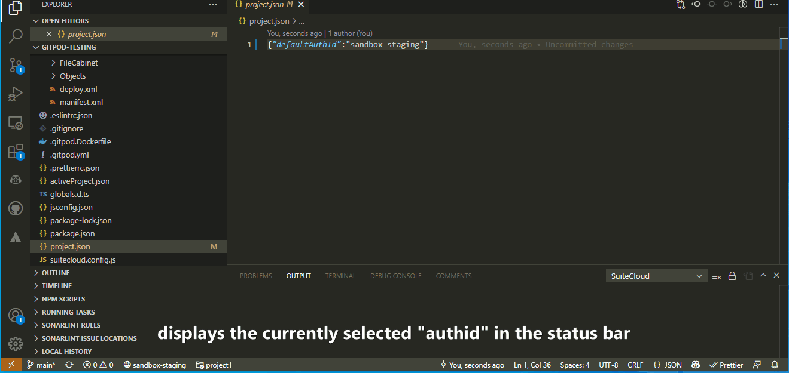

# SuiteCloud++

A VSCode extension to supercharge NetSuite development.

## Features

- Better multi environment support - a status bar indicator displays active environment, and provides a much quicker way of switching between environments



- Multi project support - allows you to work on multiple SDF projects in a single VS Code workspace and seamlessly switch between them


## Installation

At this time, this extension has not been published on the VS Code Marketplace. To build manually, clone this repository and run:

- `npm install`
- `npx vsce package`

This will generate a *.vsix file which you can right click on within VS Code and select "Install Extension VSIX".

## Usage

### Multi Environment Support

Multi Environment Support requires [SuiteCloud CLI for Node.js](https://github.com/oracle/netsuite-suitecloud-sdk/tree/master/packages/node-cli).
 
The project's currently selected environment (authid) is displayed in the status bar at the bottom right. Click on it to switch between environments.

**NOTE**: To imporove speed, the list of authids is cached when the extension is opened. If you add additional accounts, you will need to re-open VS Code to use them.

### Multi Project Support

1. Add a file `activeProject.json` to root of your project with the following contents:

   ```lang:json
    {
        "defaultProjectFolder": "src/<Name of Default SDF Project To Use>"
    }
    ```

2. Modify `suitecloud.config.js`

    ```lang:js
    const { defaultProjectFolder } = require("./activeProject.json");
 
    module.exports = {
      defaultProjectFolder: defaultProjectFolder,
      commands: {},
    };
    ```

 3. Create a `src` directory in the root of your project, and each SDF project as a subfolder
 
 4. The script will monitor the active editor, and update the active project accordingly
